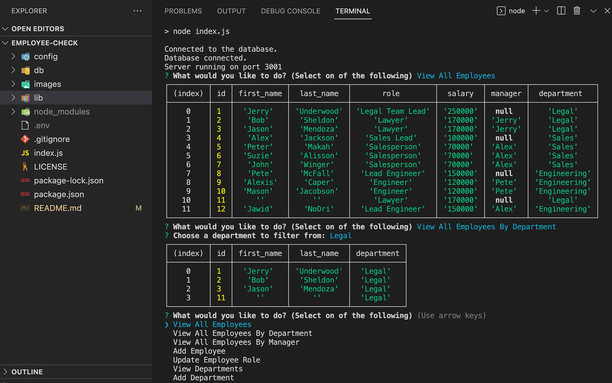

# Employee-Check

a command-line application to manage a company's employee database, using Node.js, Inquirer, and MySQL.

## User Story

AS A business owner<br />
I WANT to be able to view and manage the departments, roles, and employees in my company<br />
SO THAT I can organize and plan my business<br />

## Acceptance Criteria

GIVEN a command-line application that accepts user input<br />
WHEN I start the application<br />
THEN I am presented with the following options: view all departments, view all roles, view all employees, add a department, add a role, add an employee, and update an employee role<br />
WHEN I choose to view all departments<br />
THEN I am presented with a formatted table showing department names and department ids<br />
WHEN I choose to view all roles<br />
THEN I am presented with the job title, role id, the department that role belongs to, and the salary for that role<br />
WHEN I choose to view all employees<br />
THEN I am presented with a formatted table showing employee data, including employee ids, first names, last names, job titles, departments, salaries, and managers that the employees report to<br />
WHEN I choose to add a department<br />
THEN I am prompted to enter the name of the department and that department is added to the database<br />
WHEN I choose to add a role<br />
THEN I am prompted to enter the name, salary, and department for the role and that role is added to the database<br />
WHEN I choose to add an employee<br />
THEN I am prompted to enter the employee’s first name, last name, role, and manager and that employee is added to the database<br />
WHEN I choose to update an employee role<br />
THEN I am prompted to select an employee to update and their new role and this information is updated in the database <br />

## Video Walkthrough

- [Watch Here]()

## Screenshot



## Installation

run the following in the terminal:

```md
npm install mysql2
```

```md
npm install inquirer
```

```md
npm install console.table --save
```

in terminal

## Usage

- Navigate to db/connection.js and input your my sql user and password,
- run database, schema, and seeds files by running the follow commands in mysql shell:

```md
source db/db.sql
```

```md
source db/schema.sql
```

```md
source db/seeds.sql
```

- Navigate to the root directory of the project and type in terminal:

```md
node index
```

- Then navigate through the prompts

## Credits

Node.js, Inquirer, and MySql

## Contributing

For contributing to this project, please follow the guidelines of the:

[](https://www.contributor-covenant.org/version/2/1/code_of_conduct/)
